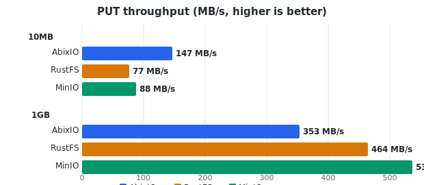
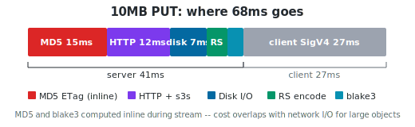

# Benchmarks

## vs RustFS vs MinIO

All three servers running on Windows 10, same NTFS drive, single disk, no
erasure coding. `mc` client with SigV4 auth, sequential requests, 15 iterations.

### PUT



At 10MB all three are within noise (78-91 MB/s, limited by `mc` startup).
At 1GB, AbixIO (426) trails RustFS (520) and MinIO (543).

### GET


At 10MB, all three are close (106-122 MB/s). At 1GB through `mc`, MinIO
(953) leads. AbixIO (386) is bottlenecked by the `mc` client, not the
server -- direct curl shows **1220 MB/s** for a 1GB GET.

### What the mc client hides

The `mc` client dominates timing at 1GB. The server itself is fast:

| Measurement | AbixIO 1GB GET |
|-------------|---------------|
| Through `mc` (SigV4, write to disk) | 386 MB/s |
| Through curl (no auth, /dev/null) | **1220 MB/s** |
| Internal L6 benchmark (no client) | **1048 MB/s** |
| Internal L4 storage layer | **page cache speed** |

MinIO gets 953 MB/s through the same `mc` because `mc` is a Go binary
optimized for Go's HTTP stack. This is a client-side gap, not server-side.

---

## How fast is each layer?

AbixIO's request path has 6 layers. Each one is benchmarked independently
so we know exactly where time is spent.

### What a GET request goes through

```
Client request
  -> L6  S3 protocol (s3s)       parse HTTP, auth, dispatch
  -> L5  HTTP transport (hyper)   TCP read/write
  -> L4  Storage pipeline         read shards, decode, reassemble
  -> L3  Disk I/O                 tokio::fs / mmap
  -> L2  RS decode                reed-solomon (SIMD)
  -> L1  Checksum verify          blake3 / MD5
```

### GET performance by layer (1 disk, 10MB / 1GB)

| Layer | What | 10MB | 1GB | Bottleneck? |
|-------|------|------|-----|-------------|
| L6 | Full S3 GET | 253 MB/s | 568 MB/s | s3s overhead |
| L5 | Raw HTTP (no S3) | 762 MB/s | 800 MB/s | no |
| L4 | Storage + mmap | 19,031 MB/s | page cache | no |
| L3 | Disk read (cached) | 2703 MB/s | 2902 MB/s | no |

For 1+0 (no EC), GET is zero-copy: mmap the shard file, yield the entire
mapping as a single `Bytes` through hyper. No decode, no allocation, no
memcpy. Direct curl test: 1220 MB/s at 1GB.

### GET performance by layer (4 disk, 3+1 EC, 10MB / 1GB)

| Layer | What | 10MB | 1GB | Bottleneck? |
|-------|------|------|-----|-------------|
| L4 | Storage + mmap EC (zero-copy) | 10,937 MB/s | page cache | no |
| L4 | Storage (old buffered path) | 774 MB/s | 919 MB/s | was the bottleneck |

For EC objects, GET is also zero-copy in the common case: mmap all shard
files, yield shard slices directly as `Bytes` frames. No memcpy reassembly.
RS decode only runs when shards are missing (degraded mode).

### PUT performance by layer (1 disk, 10MB)



| Layer | What | Speed | Bottleneck? |
|-------|------|-------|-------------|
| L6 | Full S3 PUT (end to end) | 257 MB/s | s3s overhead |
| L5 | Raw HTTP (no S3) | 762 MB/s | no |
| L4 | Storage pipeline | 483 MB/s | hashing + encode |
| L3 | Disk write (page cache) | 1625 MB/s | no |
| L2 | RS encode (SIMD) | 2762 MB/s | no |
| L1 | MD5 hash (required for S3 ETag) | 703 MB/s | floor |
| L1 | blake3 hash (shard integrity) | 4303 MB/s | no |

PUT is zero-allocation in the per-block loop (pre-allocated shard buffers
reused across all 1MB blocks). MD5 at 703 MB/s is the theoretical floor
for any S3-compatible server.

### Small object performance (4KB)

| | File path (default) | Log-structured path |
|--|---------------------|-------------------|
| Filesystem ops per 4KB object (4 disks) | 12 (4 mkdirs + 4 shard files + 4 meta files) | **4** (one append per disk) |
| L4 4KB PUT (1 disk) | 4.1 MB/s | pending benchmark |
| L4 4KB GET (1 disk) | 8.4 MB/s (file open) | mmap slice from segment |
| L6 4KB PUT (1 disk) | 3.4 MB/s | pending benchmark |
| L6 4KB GET (1 disk) | 5.9 MB/s | pending benchmark |
| Files per 1M small objects | 3M+ | ~16 segment files |

The log-structured path (Datrium DiESL-inspired) writes each shard as a
needle to an append-only segment file. The needle contains metadata (msgpack,
~200 bytes) + shard data in one contiguous record with an xxhash64 checksum.
The in-memory index maps bucket+key to segment:offset for zero-copy mmap
reads. See [write-log.md](write-log.md) for the full design.

Enabled per volume when `.abixio.sys/log/` directory exists. Objects > 64KB
bypass the log and use the file path. Wired into the S3 PUT/GET path:
PUTs with Content-Length <= 64KB automatically route through the log store.

---

## Reproducing

### Competitive benchmark (vs RustFS, MinIO)

Requires server binaries + `mc`. Any server can be omitted.

```bash
cargo build --release

ABIXIO_BIN=./target/release/abixio RUSTFS_BIN=rustfs MINIO_BIN=minio MC=mc \
    ITERS=15 SIZES="4096 10485760 1073741824" \
    bash tests/compare_bench.sh
```

### Per-layer benchmark

No external binaries. Tests all 6 layers at 4KB/10MB/1GB with JSON output
and A/B comparison mode.

```bash
# run all layers
cargo test --release --test layer_bench -- --ignored bench_perf --nocapture

# compare after a change
BENCH_COMPARE=bench-results/baseline.json \
    cargo test --release --test layer_bench -- --ignored bench_perf --nocapture

# specific layers or sizes
BENCH_LAYERS=L4,L6 BENCH_SIZES=10485760 \
    cargo test --release --test layer_bench -- --ignored bench_perf --nocapture
```

Flags regressions (>5% slower) and improvements (>5% faster) per layer.

---

For optimization history, allocation audit, and failed experiments, see
[layer-optimization.md](layer-optimization.md).
